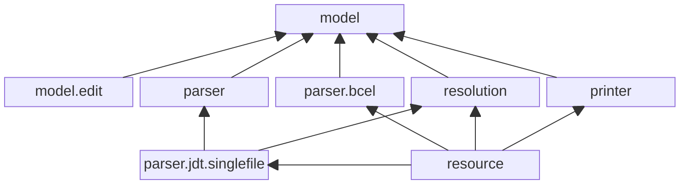

# Architecture

This document provides an overview over the architecture of the extended JaMoPP. 

The diagram shows the different components and their connections. Each component corresponds to one Maven module.

* **model** contains the defined metamodel for Java.
* **model.edit** provides generated code to support edit operations within the EMF.
* **parser** defines an interface for [parsing Java source code to models](../guides/parsing.md).
* **parser.jdt.singlefile** implements the interface from the **parser** component by parsing Java source code with the Eclipse Java Development Tools (JDT) and converting the resulting ASTs to models. This component also supports the parsing of single files without all dependencies.
* **parser.bcel** implements the class-to-model converter based on [Apache BCEL](https://commons.apache.org/proper/commons-bcel/).
* **printer** enables the [printing of models](../guides/printing.md) as Java source code.
* **resolution** contains the [reference resolution mechanisms](../guides/resolution.md) and [trivial recovery](../guides/recovery.md) for the parsed models.
* **resource** provides an EMF `Resource` implementation for the extended JaMoPP, combining features from the previous components.
