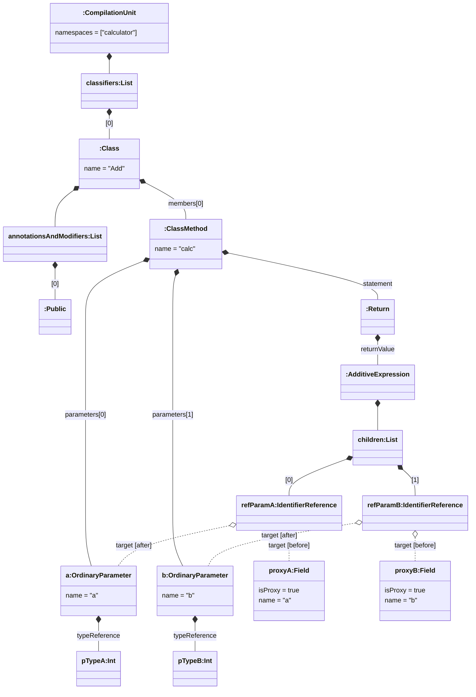
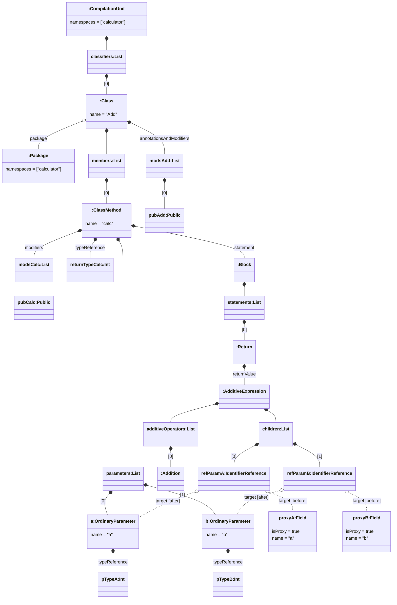
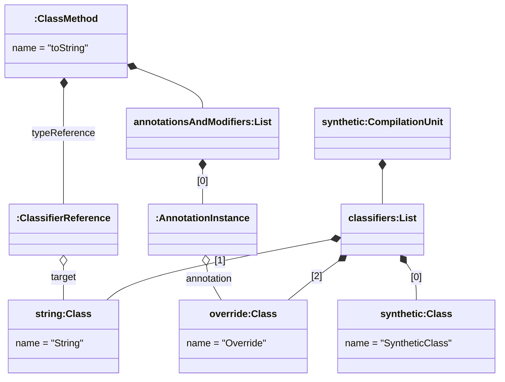

import Tabs from '@theme/Tabs';
import TabItem from '@theme/TabItem';

# Using Advanced Features

This document builds upon the [first steps tutorial](./first_steps.md) and extends it to show advanced features of the extended JaMoPP.

## References

The first advanced feature regards references.

### Resolution

In the previous part, we started to develop a simple calculator by creating a class for the addition of two numbers. Finally, we implement the actual function:

```java title="calculator/Add.java" showLineNumbers
package calculator;

public class Add {
    public int calc(int a, int b) {
        return a + b;
    }
}
```

Again, we parse the file and visualize the resulting model (also in a simplified version to support the readability):

<Tabs lazy>
<TabItem value="simplified-add-vis" label="Simplified Model" default>



</TabItem>
<TabItem value="actual-add-vis" label="Actual Model">



</TabItem>
</Tabs>

Compared to the first visualization without the `calc` method, the model now includes the method. As a consequence, the parameters, return type (`typeReference` in the actual model), and the statements of the method are also represented with corresponding model elements. In particular, the `AdditiveExpression` for the addition of `a` and `b` contains `IdentifierReference` elements signaling that identifiers are present at this position in the Java code. The actual referenced elements (the method parameters) can be accessed via the `target` EMF reference.

:::warning
The term `Reference` has a double meaning here:

1. It refers to identifiers (referencing types, fields, methods, ...) in Java code which are usually represented by `Reference` elements in the Java meta-model.
2. It refers to EMF references which allow to navigate from model elements representing an identifier in Java code to the model element referenced and identified by the identifier.
:::

References (i.e., the connection between an identifier and its referenced element) need to be resolved to be able to navigate from the identifier to the element in the model. In the current version, the parser creates proxy objects for referenced elements as placeholders for the actual elements. Depending on the parser options, they are resolved during the parsing process or when they are accessed. In both cases, the reference resolution takes the proxy object and tries to find the actual element to replace the proxy object with the found element. Therefore, in the visualization, we included and marked the proxy objects as `target [before]` the reference resolution and the actual `target [after]` the reference resolution.

:::info
The default configuration for the parser options ensures that all proxy objects are transitively resolved during parsing. As a consequence, the models contain only proxy objects if they cannot be resolved.
:::

### Dependencies

To complete the implementation of the `Add` class, we add a custom `toString` method:

```java title="Add.java" showLineNumbers
package calculator;

public class Add {
    public int calc(int a, int b) {
        return a + b;
    }

    @Override
    public String toString() {
        return "calculator.Add";
    }
}
```

In this case, `Override` and `String` present dependencies (into the Java standard library). The extended JaMoPP is able to resolve references into dependencies if they are known (i.e., the dependencies' code is given to the parser). In our example and with the default configuration, the Java standard library is automatically found and the references to `Override` and `String` can be resolved. If we alter the configuration, it may be necessary to explicitly register the Java standard library. Then, the class `tools.mdsd.jamopp.model.java.JavaClasspath` provides functionality to perform the registration:

```java
JavaClasspath.registerStdLib();
```

The `JavaClasspath` includes further methods to register zip or jar files which contain the code of dependencies:

```java
JavaClasspath.registerZip(URI.createURI("<path to zip or jar file>"));
```

If a dependency is not known during the parsing or reference resolution, the extended JaMoPP cannot resolve references to this dependency, and unresolvable proxy objects remain in the model.

## Recovery

At last, we altered the configuration so that the references to `Override` and `String` cannot be resolved. Nevertheless, to obtain a model without proxy objects, we apply the trivial recovery strategy for the `ResourceSet` `set` containing the model for `Add` and the proxy objects:

```java
new TrivialRecovery(set).recover();
```

The trivial recovery replaces proxy objects with valid model elements. When we visualize the resulting and relevant model elements, we can look into what the trivial recovery generates:



Both proxy objects are replaced by two new `Class` elements which are collected in a synthetic `CompilationUnit` so that the resulting models are still valid. Furthermore, the synthetic `CompilationUnit` contains a synthetic `Class` element in which recovered methods and fields are stored. At the same time, this means that the recovery does not take context information into account. If, for example, a method on a `String` is called, the recovered method is not contained in the recovered `String` class element.

## Outlook

This is the end of the advanced tutorial. We introduced the basics of references and their resolution and recovery. If you want more information about these implemented features, have a look at the [guides](../guides/README.md) section.
