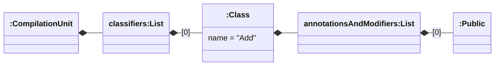

# First Steps

This document provides a minimal tutorial on how to use the extended JaMoPP to create your first models from Java code.

:::warning
This tutorial assumes that you are familiar with the Eclipse Modeling Framework (EMF). In case you want more information about EMF or Eclipse, we provide a [list of external resources and tutorials](./resources).
:::

## Parsing a File

In a new project, we want to build a calculator and analyze the code with model-driven techniques later. Thus, we leverage the extended JaMoPP and its capabilities.

The extended JaMoPP provides the class `tools.mdsd.jamopp.parser.jdt.singlefile.JaMoPPJDTSingleFileParser` to parse Java code into models. It supports a stream, file, and directory as input. In a first step, we try to parse the following code:

```java title="Add.java" showLineNumbers
public class Add {
}
```

This single file consists of an empty class for the addition of two numbers. After creating the file, we can parse it:

```java
JaMoPPJDTSingleFileParser parser = new JaMoPPJDTSingleFileParser();
Resource addClassResource = parser.parseFile(Paths.get("Add.java"));
```

The parser returns a `Resource` which contains the Java model for our first example. By traversing the model, we can visualize it:



Here, the root element `CompilationUnit` represents a Java file containing a list of classifiers defined in the file. In our case, it is only the class `Add`. This class in turn includes a list of its modifiers which is `Public` for `Add`.

## Modifying and Printing

Now, we can modify the model. Currently, the class `Add` is included in the default package which is not recommended. Thus, we want to move it into a package `calculator` and perform this change on the model level at first. The following code moves the class into the package and creates an additional package element:

```java
String packageName = "calculator";

// 1. Move the class (by its compilation unit) into the package.
CompilationUnit cu = (CompilationUnit) addClassResource.getContents().get(0);
cu.getNamespaces().add(packageName);

// 2. Create the package element.
// Full-qualified name is required here. Otherwise, `Package` defaults to `java.lang.Package`.
tools.mdsd.jamopp.model.java.containers.Package packageElement =
    ContainersFactory.eINSTANCE.createPackage();
packageElement.getNamespaces().add(packageName);
// The package element can be set as the package of the class `Add`.
cu.getClassifiers().get(0).setPackage(packageElement);
```

:::warning
The created package element must be contained within a `Resource`. For simplicity, we left this part out.
:::

After moving the class `Add` at the model level, the files on disk should also reflect this change. So, we print the extended models:

```java
JaMoPPPrinter.print(cu, Paths.get(packageName, "Add.java"));
JaMoPPPrinter.print(packageElement, Paths.get(packageName, "package-info.java"));
```

The resulting code looks similar to the following one:

```java title="calculator/Add.java" showLineNumbers
package calculator;

class Add {
}
```

```java title="calculator/package-info.java" showLineNumbers
package calculator;
```

## Outlook

This is the end of the first steps tutorial with the extended JaMoPP. We covered the foundations of parsing, extending, and printing models. Next, we provide a second tutorial with advanced features. Otherwise, the [guides](../guides/README.md) section contains more details about the features.
